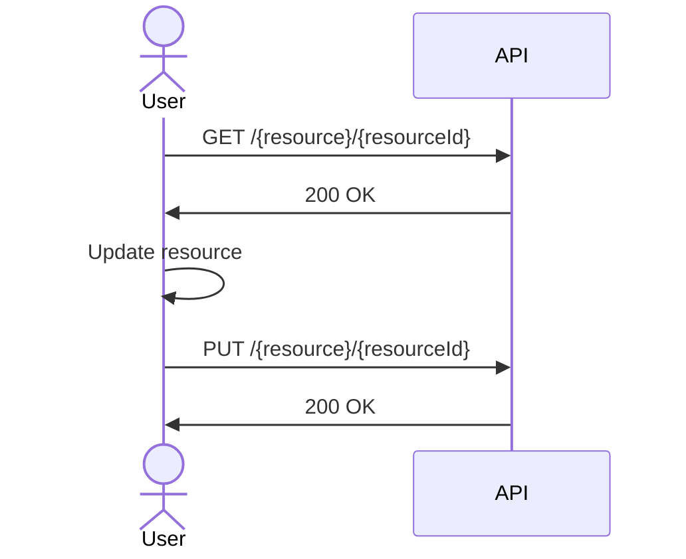
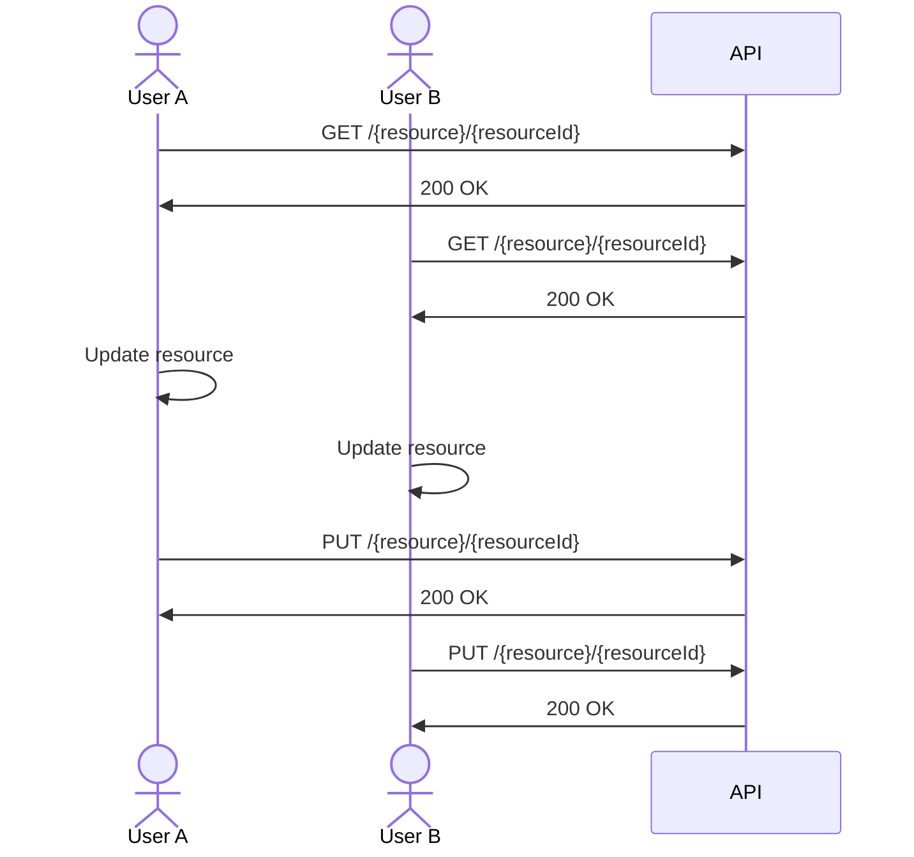
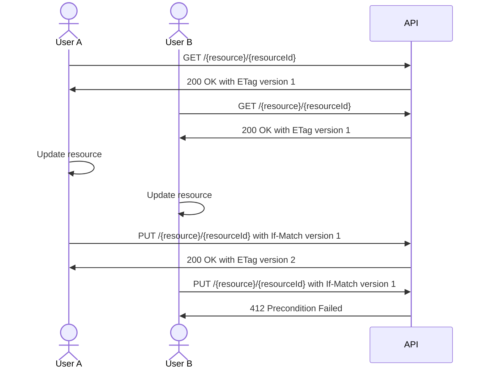

# ADR - Consistency on update operations

**Status**: Proposed

This ADR must determine if we allow or not update operations on old entity versions.

All APIs are used in a distributed environment with multiple operators.
In this case, there is a possibility of concurrent updates on the same entity.

### Simple update operation

As we can see in the following sequence diagram,
the update in operation without concurrency is simple.

### Update operation with concurrency

As we can see in the following sequence diagram,
the entity is updated by two users at the same time.

The updates done the user A are lost because the user B updated the entity after the user A.

## Proposed Solution with ETag

The GET operation must return the `ETag` header with the entity version.

The PUT operation must use the `If-Match` header with the entity version.

## Considered Options

1. Allow update operations on old entity versions

2. Do not allow update operations on old entity versions

## Pros and Cons of the Options

### Allow update operations on old entity versions

* Good, because it is simpler.
* Bad, because it can cause data loss.

### Do not allow update operations on old entity versions

* Good, because it can avoid data loss.
* Bad, because it is more complex.

## Decision Outcome

TODO

## Positive Consequences

TODO

## Negative Consequences

TODO
