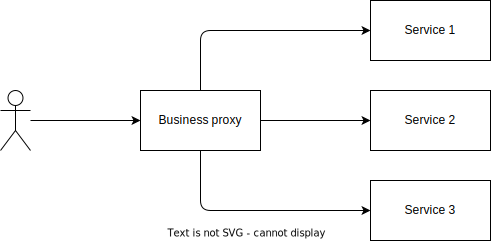

# ADR - Use a proxyfied architecture

**Status**: Proposed

This ADR must determine the way how each client must interact with the backend.

## Considered Options

1. **TMF way architecture**

    This solution is based on the TMF architecture.

    In the following diagram, the client sends requests to each service.
    Each service processes the request and sends the response back to the application.

    While each request may be done in parallel, the application must send, wait, and process data for each request,
    all on separate connections, increasing the chance of failure.

    

2. **Proxyfied architecture**

    This solution is a mixed between [the Ambassador pattern]
    and [the Gateway Aggregation pattern].

    In the following diagram, the client sends requests to the business application.
    The business application implements the complete business logic and the orchestration of the services.

    

## Pros and Cons of the Options

### TMF way architecture

* Good, because it is the TMF way.
* Bad, because the client must implement the orchestration of the services.
* Bad, because the client must implement the business logic.
* Bad, because the backend cannot guarantee the consistency of the data.

### Proxyfied architecture

* Good, because the client does not need to implement the orchestration of the services.
* Good, because the data consistency is guaranteed by the backend.
* Good, because we can reuse a service for a non TMF application.
* Good, because we can allow polymorphism usage for the business application.
* Bad, because it is not the standard TMF way.
* Bad, because each business application must rewrite its own OpenAPI documentation.

## Links

* [the Ambassador pattern]
* [the Gateway Aggregation pattern]
* [the SAGA pattern]
* [POC of the proxyfied architecture](https://github.com/ggrebert/arcep-poc-tmf)

[the Ambassador pattern]: https://learn.microsoft.com/en-us/azure/architecture/patterns/ambassador
[the Gateway Aggregation pattern]: https://learn.microsoft.com/en-us/azure/architecture/patterns/gateway-aggregation
[the SAGA pattern]: https://microservices.io/patterns/data/saga.html

## Decision Outcome

TODO

## Positive Consequences

TODO

## Negative Consequences

TODO
